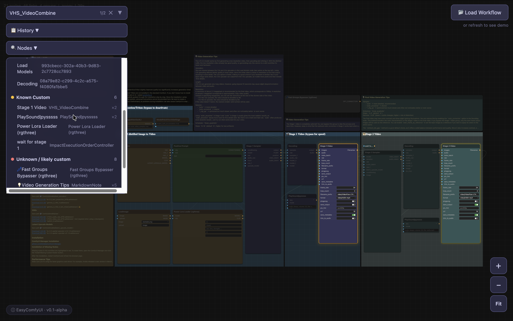

# EasyComfyUI

English | [简体中文](README.zh-CN.md)

A lightweight, read-only workflow viewer for [ComfyUI](https://github.com/comfyanonymous/ComfyUI) — designed for quick inspection and learning on mobile and browser.


---

## Why

ComfyUI workflows are powerful but can be hard to read outside the desktop environment. When you want to:

- Quickly check a workflow on your phone
- Share a workflow visualization with someone who doesn't have ComfyUI installed
- Study how a workflow is structured node by node
- Browse workflow files on a tablet without a keyboard and mouse

EasyComfyUI gives you a clean, touch-friendly read-only view — no GPU, no Python environment, no installation of ComfyUI required.

## Why it helps

Running a complex ComfyUI workflow on a high-performance machine often involves more than just loading a JSON file. Before you can hit "Queue Prompt", you typically need to:

- Read the workflow creator's notes and instructions embedded in nodes
- Open model download links (Civitai, Hugging Face) and resource pages (GitHub, documentation)
- Identify which custom nodes are required and whether you have them installed
- Collect or download the necessary model files, LoRAs, and embeddings

EasyComfyUI lets you do most of this **before** you sit down at your main workstation:

- **Inspect workflow notes** on your phone or tablet during commute, in a meeting, or anywhere
- **Open model and resource links** in your system browser — Civitai, Hugging Face, GitHub, documentation pages — all directly from the app
- **Start preparing resources** — begin downloads or make a list of what you need to collect before returning to your ComfyUI machine

EasyComfyUI does **not** automatically download models or resources. It simply surfaces the links that are already embedded in the workflow, so you can act on them at your own pace.

## Features

- **Node graph rendering** — zoom, pan, fit-to-view
- **Workflow loading** — via file picker or drag-and-drop (JSON format)
- **Node search** — search by name, type, or widget value; highlight and jump between matches
- **Markdown link support** — clickable links in node descriptions
- **Widget value display** — text, number, boolean, combo, slider, etc.
- **Slot connection visualization** — input/output ports with color-coded links
- **Group rendering** — collapsible node groups
- **Collapsed node rendering** — compact view for large workflows
- **Node source classification** — built-in, custom, or missing node detection
- **Workflow history** — recently opened files
- **Nodes source summary** — overview of node types in the workflow
- **Dark theme** — easy on the eyes

## Screenshots

### Android


### Web


### Node filtering and source summary



## Download

### Android

Download the latest APK from the [Releases](https://github.com/Andrew-AI-Kitchen/EasyComfyUI/releases) page.

| Build | File | Use Case |
|---|---|---|
| Alpha | `EasyComfyUI-v0.1.0-alpha.apk` | Real device installation via file manager |

### Web

Open `web-viewer/index.html` in any modern browser (Chrome, Firefox, Safari, Edge). Because the viewer uses ES modules, you need a local HTTP server:

```bash
python3 -m http.server 8000
```

Then open `http://localhost:8000/web-viewer/index.html` in your browser.

## Android Usage

1. Download the APK from Releases
2. Open the APK on your Android device and tap "Install"
3. Open EasyComfyUI
4. Tap the folder icon to select a workflow JSON file, or use the share/open-with menu from a file manager
5. The workflow graph will render automatically

### Build from Source

```bash
cd android
./gradlew assembleAlpha
# APK output: android/app/build/outputs/apk/alpha/EasyComfyUI-v{version}.apk
```

## Web Usage

1. Open `web-viewer/index.html` in a browser
2. Drag and drop a workflow JSON file onto the page, or click the folder icon to browse
3. The workflow graph will render automatically

Controls:
- **Scroll / pinch** — zoom in/out
- **Drag** — pan the canvas
- **Double-click** — fit view to all nodes
- **Search bar** — type to search nodes; press Enter to jump between matches

## Scope

EasyComfyUI is a **read-only workflow viewer**. It focuses on:

- ✅ Rendering workflow graphs from standard ComfyUI workflow JSON
- ✅ Displaying node titles, types, inputs, outputs, and widget values
- ✅ Visualizing connections between nodes
- ✅ Providing a smooth mobile touch experience

It does **not**:

- ❌ Execute or run workflows
- ❌ Edit or modify workflows
- ❌ Replace ComfyUI in any capacity
- ❌ Require a GPU, Python, or ComfyUI installation

## Node Source Classification

EasyComfyUI classifies nodes into four categories based on the built-in node definitions and heuristic analysis:

| Category | Description |
|----------|-------------|
| **Built-in Core** | Nodes that match known ComfyUI built-in node types |
| **Subgraph** | Nodes that appear to be subgraph/group nodes embedded in the workflow |
| **Known Custom** | Nodes that match known custom node types from popular extensions |
| **Unknown or likely custom** | Nodes whose type is not recognized — likely from custom nodes not in the reference list |

This classification helps you understand which parts of a workflow rely on standard vs. custom components. Note that the classification is based on a static reference list and may not be exhaustive — a node classified as "Unknown or likely custom" may still be a built-in node not covered by the current reference data.

## Relationship to ComfyUI

EasyComfyUI is an independent, third-party project. Here is what you should know:

- This project **studied the ComfyUI workflow JSON structure and frontend rendering behavior** to build a compatible viewer
- It is a **simplified, read-only reimplementation** of the workflow visualization, built from scratch using Canvas API
- It is **not affiliated with or endorsed by** the ComfyUI project or its maintainers
- It does **not include or redistribute** any ComfyUI source code
- It is **not a replacement** for ComfyUI — you still need ComfyUI to create and execute workflows
- The workflow JSON format is an open, community-adopted format; this project simply renders it

## Known Limitations

- Alpha quality — bugs and incomplete features are expected
- No workflow execution — this is a viewer only
- No node editing or creation
- No real-time updates or queue management
- Limited to workflow JSON format; does not support other formats
- Some complex widget types may not render perfectly
- Performance may degrade with very large workflows (1000+ nodes)

## Sample workflows

Sample workflow JSON files are available in [`sample-workflows/`](sample-workflows/).

They are included for viewer testing, learning, and compatibility demonstration. The workflows are sourced from public Civitai pages, and their authorship, licensing, model requirements, and setup instructions should be checked on the original pages.

Sources:

- [VideoFlow LTX 2.3 / Wan 2.2 I2V workflow](https://civitai.com/models/1815300/videoflow-ltx-23-wan-2221-i2v-image-to-video-img2vid-workflow)
- [Illustrious Pony SDXL pro-grade workflow](https://civitai.com/models/2189190/illustrious-pony-sdxl-pro-grade-workflow-low-or-high-vram?modelVersionId=2888654)

Thanks to the original workflow creators and the Civitai community.

## Roadmap

- [ ] Package a macOS desktop version with full local history support
- [ ] Extract and categorize accessible workflow resource links, such as model downloads, GitHub repositories, Civitai pages, and documentation links
- [ ] Improve Android safe-area handling for status bars and navigation bars

## License

[MIT](LICENSE)
