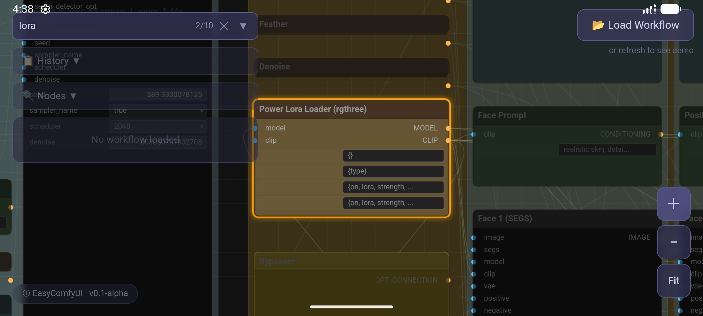
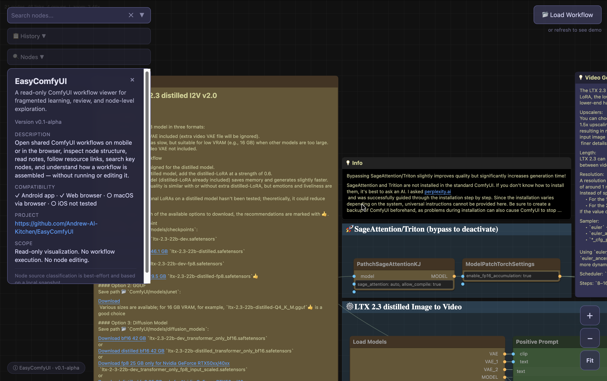

# EasyComfyUI

[English](README.md) | 简体中文

一个轻量级的只读工作流查看器，专为 [ComfyUI](https://github.com/comfyanonymous/ComfyUI) 设计——让你在手机和浏览器上快速查看和学习工作流。


---

## 为什么需要 EasyComfyUI

ComfyUI 工作流功能强大，但在桌面环境之外难以阅读。当你想要：

- **碎片化学习** — 在通勤、排队等碎片时间里快速浏览一个工作流
- **工作流拆解** — 逐节点理解工作流的每个环节做了什么
- **节点级理解** — 查看每个节点的输入、输出、参数配置，而不被执行环境干扰
- **移动端/浏览器快速查看** — 在手机或平板上打开工作流文件，无需启动 ComfyUI

EasyComfyUI 提供了一个简洁、触控友好的只读视图——不需要 GPU、Python 环境或安装 ComfyUI。

## 它能节省什么时间

在高端机器上运行一个复杂 ComfyUI 工作流，远不止"加载 JSON 文件然后点生成"这么简单。在真正开始跑图之前，通常需要：

- 阅读工作流作者嵌入在节点中的说明和操作指引
- 打开模型下载链接（Civitai、Hugging Face）和资源页面（GitHub、文档）
- 确认需要哪些自定义节点，以及是否已安装
- 收集或下载所需的模型文件、LoRA、embedding 等资源

EasyComfyUI 让你在回到主力工作站**之前**就能完成大部分准备工作：

- **在手机或平板上阅读工作流说明** — 通勤、会议间隙，随时随地
- **通过系统浏览器打开资源链接** — Civitai、Hugging Face、GitHub、文档页面，都可以从 App 直接跳转
- **提前开始准备资源** — 开始下载或记录需要收集的内容，回到 ComfyUI 机器时直接开跑

EasyComfyUI **不会自动下载模型或资源**。它只是把工作流中已有的链接呈现出来，让你按自己的节奏处理。

## 功能

- **节点图渲染** — 缩放、平移、自适应视图
- **工作流加载** — 通过文件选择器或拖拽加载 JSON 格式的工作流
- **节点搜索** — 按名称、类型或参数值搜索；高亮显示并跳转匹配节点
- **Markdown 链接** — 节点描述中的可点击链接
- **参数值显示** — 文本、数字、布尔值、下拉选择、滑块等
- **连线可视化** — 输入/输出端口及颜色编码的连接线
- **分组渲染** — 可折叠的节点分组
- **折叠节点渲染** — 大型工作流的紧凑视图
- **节点来源分类** — 内置节点、自定义节点、缺失节点检测
- **工作流历史** — 最近打开的文件记录
- **节点来源汇总** — 工作流中节点类型的概览
- **深色主题** — 护眼设计

## 截图




## 下载

### Android

从 [Releases](https://github.com/Andrew-AI-Kitchen/EasyComfyUI/releases) 页面下载最新 APK。

| 构建类型 | 文件 | 用途 |
|---------|------|------|
| Alpha | `EasyComfyUI-v0.1.0-alpha.apk` | 真机文件管理器安装 |
|---|---|---|---|

### Web

在任何现代浏览器（Chrome、Firefox、Safari、Edge）中打开 `web-viewer/index.html`。由于查看器使用 ES 模块，你需要一个本地 HTTP 服务器：

```bash
python3 -m http.server 8000
```

然后在浏览器中打开 `http://localhost:8000/web-viewer/index.html`。

## Android 使用说明

1. 从 Releases 下载 APK
2. 在 Android 设备上打开 APK 文件，点击"安装"
3. 打开 EasyComfyUI
4. 点击文件夹图标选择工作流 JSON 文件，或通过文件管理器的"分享/打开方式"菜单
5. 工作流图谱将自动渲染

### 从源码构建

```bash
cd android
./gradlew assembleAlpha
# APK 输出: android/app/build/outputs/apk/alpha/EasyComfyUI-v{version}.apk
```

## Web 使用说明

1. 在浏览器中打开 `web-viewer/index.html`
2. 将工作流 JSON 文件拖拽到页面，或点击文件夹图标浏览选择
3. 工作流图谱将自动渲染

操作方式：
- **滚动 / 双指缩放** — 放大/缩小
- **拖拽** — 平移画布
- **双击** — 自适应视图到所有节点
- **搜索栏** — 输入搜索节点；按 Enter 跳转匹配项

## 项目范围

EasyComfyUI 是一个**只读工作流查看器**。它专注于：

- ✅ 从标准 ComfyUI 工作流 JSON 渲染工作流图谱
- ✅ 显示节点标题、类型、输入、输出和参数值
- ✅ 可视化节点之间的连接关系
- ✅ 提供流畅的移动端触控体验

它**不**：

- ❌ 执行或运行工作流
- ❌ 编辑或修改工作流
- ❌ 以任何方式替代 ComfyUI
- ❌ 需要 GPU、Python 或 ComfyUI 安装

## 节点来源分类

EasyComfyUI 根据内置节点定义和启发式分析将节点分为四类：

| 类别 | 说明 |
|------|------|
| **内置核心** | 匹配已知 ComfyUI 内置节点类型的节点 |
| **子图** | 看起来是工作流中嵌入的子图/分组节点 |
| **已知自定义** | 匹配已知流行扩展的自定义节点类型的节点 |
| **未知或可能自定义** | 无法识别类型的节点——可能来自参考列表中未收录的自定义节点 |

这种分类帮助你理解工作流中哪些部分依赖标准组件，哪些依赖自定义组件。请注意，分类基于静态参考列表，可能并不全面——被归类为"未知或可能自定义"的节点仍可能是当前参考数据未覆盖的内置节点。

## 与 ComfyUI 的关系

EasyComfyUI 是一个独立的第三方项目。请注意以下声明：

- 本项目**研究了 ComfyUI 工作流 JSON 结构和前端渲染行为**，以构建兼容的查看器
- 这是一个**简化的、只读的重新实现**，使用 Canvas API 从头构建
- 本项目**与 ComfyUI 项目及其维护者无任何关联或背书关系**
- 本项目**不包含或重新分发**任何 ComfyUI 源代码
- 本项目**不能替代 ComfyUI**——你仍然需要 ComfyUI 来创建和执行工作流
- 工作流 JSON 格式是社区采用的开放格式；本项目仅负责渲染

## 已知限制

- Alpha 版本——可能存在 bug 和不完整的功能
- 不支持工作流执行——仅作为查看器
- 不支持节点编辑或创建
- 不支持实时更新或队列管理
- 仅支持工作流 JSON 格式
- 部分复杂控件类型可能无法完美渲染
- 超大型工作流（1000+ 节点）性能可能下降

## 路线图

- [ ] 打包 macOS 桌面版本，提供更完整的本地历史记录体验
- [ ] 提炼并分类 workflow 中可访问的资源链接，例如模型下载、GitHub 仓库、Civitai 页面和说明文档
- [ ] 优化 Android 状态栏、导航栏与横屏显示的安全区域适配

## 许可证

[MIT](LICENSE)
